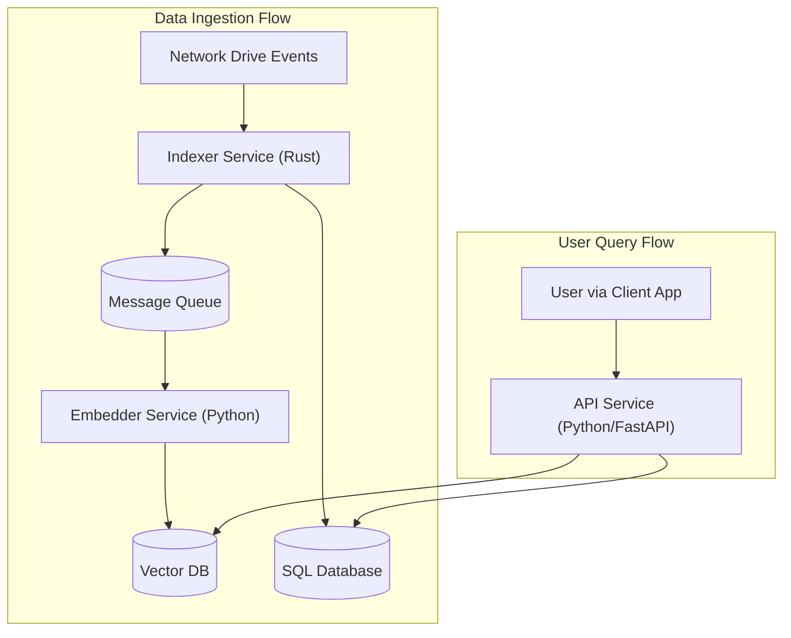

# Semantic Network Indexer

## 1. Project Overview

This project provides a semantic search and indexing solution for network drives. It moves beyond traditional keyword-based search by understanding the *meaning* and *context* of file content. Instead of matching exact words, users can search for concepts in natural language (e.g., "financial reports from last quarter about hardware acquisitions") and receive conceptually relevant results.

The system is designed as a set of independent microservices for performance, scalability, and maintainability. It relies on filesystem-native security and does not store file contents, only metadata and semantic vectors.

## 2. System Architecture

The architecture is composed of three core services that communicate via a message queue. This decouples the high-performance indexing from the resource-intensive AI processing.



1. **Indexer Service (Rust):** Watches the filesystem for changes, hashes files, and updates a central SQL database with basic metadata. It then places a job on the message queue.
2. **Embedder Service (Python):** Listens for jobs. When a new file is announced, it extracts the text, generates a semantic vector embedding, and stores it in the Vector Database.
3. **API Service (Python):** Provides the search endpoint for the user. It converts the user's query into a vector, finds similar items in the Vector DB, retrieves full details from the SQL DB, and returns the results.

## 3. Core Components

### 3.1. Indexer Service

* **Language:** Rust
* **Purpose:** A high-performance, reliable daemon that serves as the system's source of truth for file existence and basic metadata.
* **Responsibilities:**
  * Watch for file system events (create, modify, delete, rename) across multiple platforms.
  * Track files via persistent filesystem IDs to handle renames/moves correctly.
  * Perform efficient, multi-threaded SHA256 hashing of file content.
  * Update the primary SQL database with file paths, hashes, and timestamps.
  * Dispatch processing jobs to the message queue.

### 3.2. Embedder Service

* **Language:** Python
* **Purpose:** The AI core of the system, responsible for understanding and vectorizing file content.
* **Responsibilities:**
  * Consume jobs from the message queue.
  * Extract text content from various file formats (`.docx`, `.pdf`, `.txt`, etc.).
  * Generate semantic vector embeddings using a sentence-transformer model.
  * Store the resulting vectors in the vector database, linked to the file ID.

### 3.3. API Service

* **Language:** Python (using FastAPI)
* **Purpose:** A secure and fast interface for any client application to use.
* **Responsibilities:**
  * Expose a RESTful `/search` endpoint.
  * Process and embed natural language queries from the user.
  * Orchestrate searches against the vector and SQL databases.
  * Enforce access control rules before returning results.
  * Format and deliver search results as JSON.

## 4. Local Development Setup

### Prerequisites

* Docker & Docker Compose
* Rust (and Cargo)
* Python 3.10+

### Configuration

The system is configured using environment variables. Create a `.env` file in the project root by copying the example:

```bash
cp .env.example .env
```

Then, edit the `.env` file with your local database credentials and other settings.

### Running the System

The recommended way to run the full system for development is with Docker Compose. This will spin up the required databases, the message queue, and all three services.

```bash
# Build and start all services in detached mode
docker-compose up --build -d
```

To run a specific service manually for debugging, navigate to its directory and use the appropriate command.

**Indexer (Rust):**

```bash
# From the /indexer directory
cargo run
```

**Embedder & API (Python):**

```bash
# From the /embedder or /api directory
# It is recommended to use a virtual environment
python -m venv .venv
source .venv/bin/activate
pip install -r requirements.txt
uvicorn main:app --reload
```

## 5. Technology Stack

* **Backend Services:** Rust, Python 3
* **API Framework:** FastAPI
* **Concurrency (Rust):** Tokio
* **Primary Database:** TBD
* **Vector Database:** ChromaDB / Weaviate / Pinecone (TBD)
* **Message Queue:** RabbitMQ (TBD)
* **AI/ML:** Hugging Face Transformers, Sentence-Transformers (TBD)
* **Containerization:** Docker (TBD)

## General Flow


